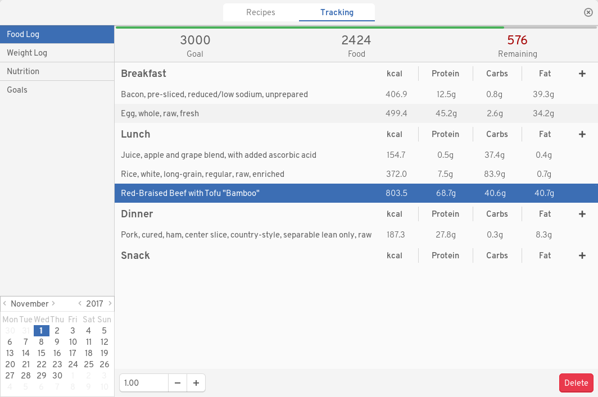
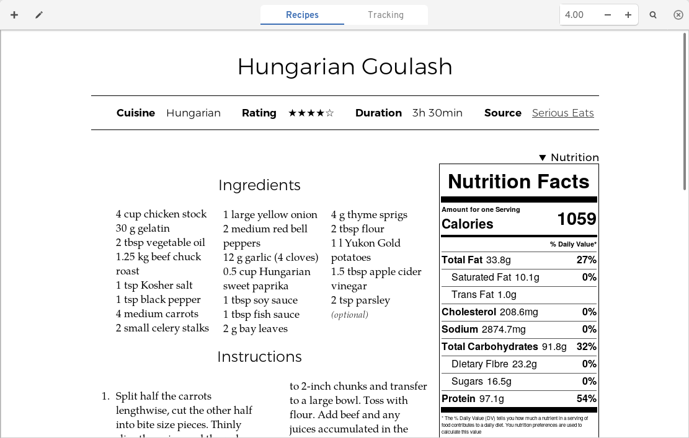

garlic
======

A recipe management and nutrition tracking application for GNOME. Written
primarily for personal use, since there was no existing application fitting the
bill. GNOME Recipes doesn't do nutrition tracking at all, and has elements of a
social network, which I didn't want. Gourmet is outdated (still using GTK 2),
and also doesn't do tracking. There are mobile apps, but I did not want to have
two separate databases for keeping track of two halves of the same thing.

Screenshots
-----------

Features
--------

+ Manage Recipes on the basis of a database of ingredients
+ Local database for everyone
+ Automatic nutrition labels for each recipe, calculated from the ingredients,
  with percentages of daily goals.
+ Display of recipes with adjustable servings
+ Recipes are searchable (currently only by name)
+ Food and weight logging
+ Nutrition information based on logs
+ Freely adjustable nutrition goals
+ Largely adhering to the GNOME HIG.

Hacking Notes
-------------

At this point, there are a lot of rough edges about the code. It's not exactly
pretty, but it works. This is the result of a few experiments in how to
structure non-trivial GUI code in Haskell when using reactive-banana in
conjunction with a database backend. Nonetheless if you can fight your way
through this mess, pull requests are always welcome.

Future
------

Please do note that some future version might completely trash your database for
no reason. I attempt not to make such changes, since it would also affect my own
database, but I will not make any guarantees.

Future features may or may not include prices for ingredients (and thus recipes,
as well as total cost per day), copying of logs from one day to the next,
and enhanced recipe search.
